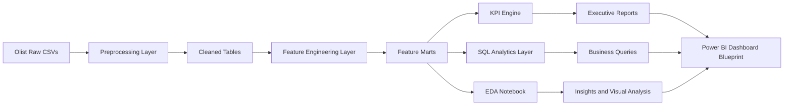

# Architecture Diagram

## Overview

RetailIQ is organized as a layered analytics system: raw data ingestion, preprocessing, feature engineering, KPI generation, SQL reporting, and executive visualization.

## Architecture Diagram

## Layer Responsibilities

### 1. Raw Data Layer
- Source: Brazilian E-Commerce Public Dataset by Olist
- Contains transactional, product, customer, seller, payment, and review tables

### 2. Preprocessing Layer
- Loads the raw CSV files
- Standardizes column names
- Handles missing values and duplicates
- Converts datatypes and parses dates
- Saves cleaned outputs for reuse

### 3. Feature Engineering Layer
- Creates business-ready fact and dimension tables
- Derives order, customer, product, seller, and time-based features
- Builds reusable feature marts for downstream reporting

### 4. KPI Engine
- Computes management metrics such as revenue, orders, AOV, retention, and regional revenue
- Returns pandas DataFrames for integration into notebooks and reporting layers

### 5. SQL Analytics Layer
- Contains optimized queries for business questions
- Supports repeatable reporting outside Python

### 6. Visualization and Reporting Layer
- EDA notebook for analysis
- Power BI dashboard blueprint for executive consumption
- Business memo for senior leadership

## Design Rationale

- The architecture separates transformation logic from reporting logic.
- Reusable feature outputs avoid duplicate calculations.
- KPI outputs remain in pandas DataFrames to support notebooks and automated reports.
- SQL queries are stored separately to preserve portability and performance.