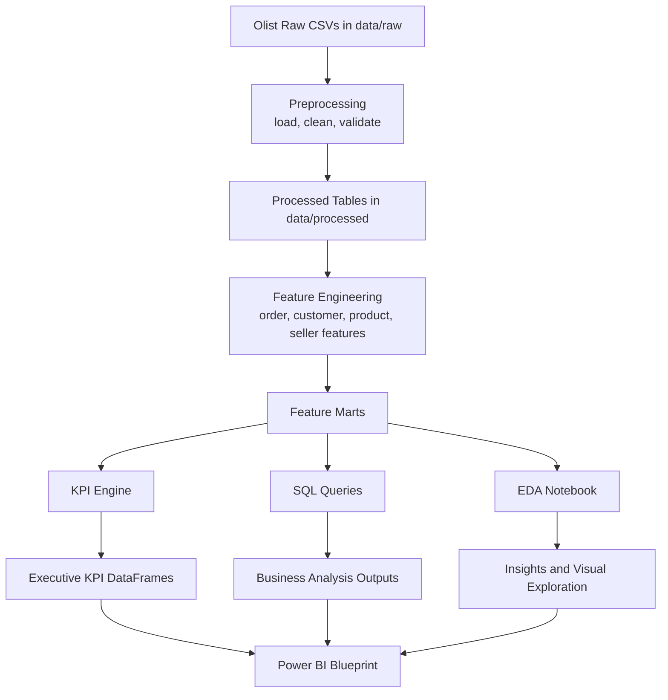

# Data Flow Diagram

## Data Flow

RetailIQ follows a linear but reusable data flow from source files to executive outputs.

## Input Tables

- Orders
- Order items
- Order payments
- Order reviews
- Customers
- Sellers
- Products
- Category translation
- Geolocation

## Transformation Stages

### Stage 1: Preprocessing
- Read all raw inputs
- Normalize schema
- Remove duplicates
- Fill gaps in critical fields
- Parse timestamps

### Stage 2: Feature Engineering
- Build order-level and item-level facts
- Build customer and seller dimensions
- Add monthly, weekly, and geographic attributes

### Stage 3: KPI Computation
- Total revenue
- Total orders
- Average order value
- Profit margin when cost data exists
- Repeat customer rate
- Customer retention
- Revenue by state and category

### Stage 4: Reporting Outputs
- EDA notebook
- SQL business queries
- Power BI executive dashboard blueprint
- Leadership memo

## Output Principles

- Each output layer is reusable.
- Each transformation is traceable.
- Business logic is centralized to avoid metric drift.